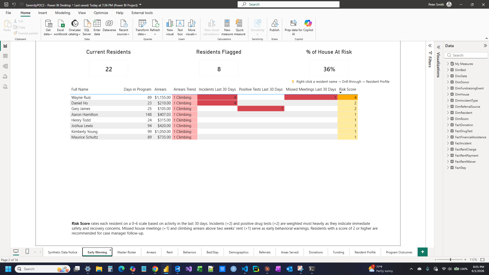
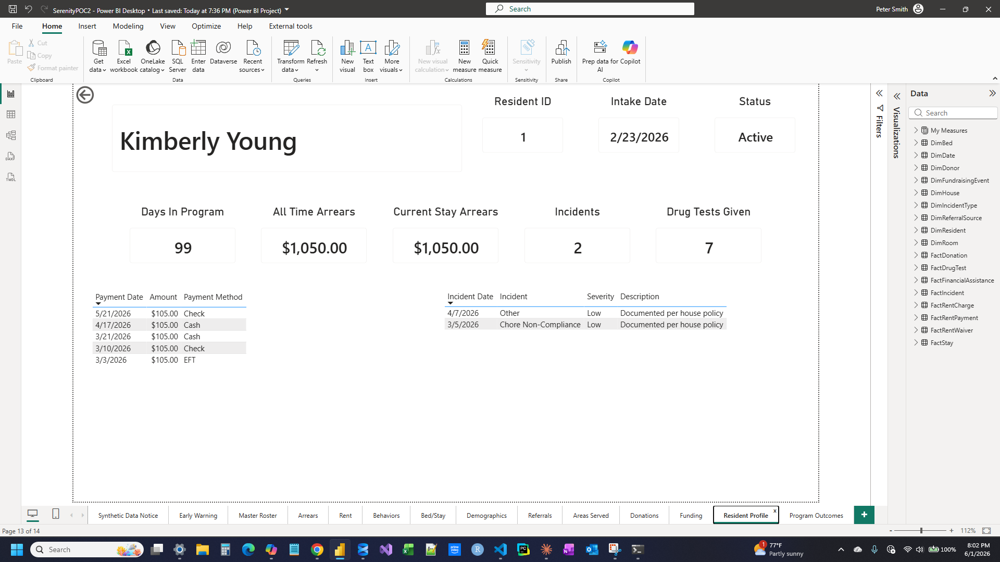
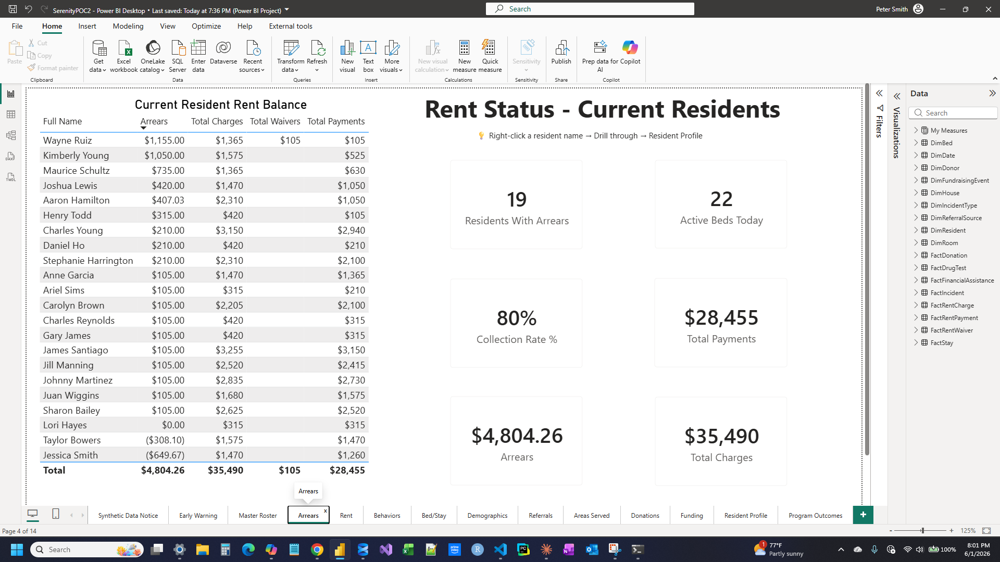

# Serenity House Analytics PoC

A full-stack analytics proof of concept built for **Serenity House**, a 45-bed nonprofit sober living / recovery residence in Clarksville, Indiana. The system demonstrates how a modern data pipeline — from synthetic data generation through a star-schema data warehouse to interactive Power BI dashboards — can replace manual spreadsheet reporting and give staff and leadership actionable, real-time insight into resident outcomes, finances, and program health.

> **Portfolio project.** Built to demonstrate end-to-end data engineering and analytics skills across SQL Server, Python, DAX, and Power BI. All resident data is fully synthetic.

---

## Screenshots

| Early Warning | Resident Profile | Arrears |
|---|---|---|
|  |  |  |

---

## What It Does

- **Models 500 synthetic residents** across 700 program stays spanning 2022–2029, with realistic behavioral clustering (Reliable 60% / Struggling 30% / Chronic 10%) driving incident rates, rent payment behavior, and drug test outcomes
- **Behavior-driven exit modeling** — program completion vs. termination vs. transfer is determined post-hoc from each resident's actual incident count, rent payment rate, and drug test positive rate during their stay
- **14 interactive Power BI dashboard pages** covering occupancy, rent & arrears, demographics, referral sources, donations, funding assistance, behavior incidents, bed/stay utilization, program outcomes, and individual resident drillthrough profiles
- **Early Warning system** — flags at-risk current residents by incident rate, arrears trend, drug test results, and missed meetings; weighted risk score (0–6) sorts worst cases to the top for weekly case manager review
- **Resident Profile drillthrough** — right-click any resident name anywhere in the report to drill through to their full history: days in program, arrears, incident log, payment history
- **One-command rebuild** — `python rebuild.py` drops, recreates, and repopulates the entire database with fresh synthetic data

---

## Tech Stack

| Layer | Technology |
|---|---|
| Data generation | Python 3 (pyodbc, Faker, deterministic seed=42) |
| Operational schema | SQL Server OLTP (`sh` schema, normalized, 15+ tables) |
| Data warehouse | SQL Server star schema (`dw` schema, 9 dims + 8 facts) |
| ETL | T-SQL stored in version-controlled scripts |
| Semantic model | Power BI PBIP format (TMDL, fully git-tracked) |
| Dashboards | Power BI Desktop, 50+ DAX measures |
| Automation | Python rebuild script, PowerShell screenshot automation |
| Version control | Git / GitHub |

---

## Architecture

```
Python Generator (v7, seed=42, 500 residents)
      │
      ▼
SQL Server OLTP  (sh schema — normalized operational model)
  sh.Resident, sh.Stay, sh.Bed, sh.Room, sh.House
  sh.RentCharge, sh.RentPayment, sh.RentWaiver
  sh.DrugTest, sh.Incident, sh.StayEmploymentSnapshot
  sh.ServiceEncounter, sh.Outcome, sh.SecurityIdentityMap
  sh.Donor, sh.FundraisingEvent, sh.FundraisingDonation
  sh.FinancialAssistanceProgram, sh.ProgramPayment
      │
      ▼  (T-SQL ETL — sql/dw/02_etl.sql)
SQL Server Data Warehouse  (dw schema — star schema)
  Dims: DimDate, DimResident, DimBed, DimRoom, DimHouse,
        DimCaseManager, DimIncidentType, DimReferralSource,
        DimDonor, DimFundraisingEvent
  Facts: FactStay, FactRentCharge, FactRentPayment, FactRentWaiver,
         FactIncident, FactDrugTest, FactDonation, FactFinancialAssistance
      │
      ▼
Power BI Semantic Model  (PBIP / TMDL — version controlled)
  50+ DAX measures, calculated columns, inactive date relationships
      │
      ▼
Power BI Dashboards  (14 pages)
```

---

## Dashboard Pages

| # | Page | What It Shows |
|---|---|---|
| 1 | Synthetic Data Notice | Context for stakeholders — what this is, what the data represents |
| 2 | Early Warning | At-risk current residents: risk score, arrears trend, incidents, missed meetings |
| 3 | Master Roster | Full stay-level list of all residents; filter by Active/Exited, search by name |
| 4 | Arrears | Resident arrears balances, trend over time, residents in arrears count |
| 5 | Rent | Weekly rent charges, collection rate, payment method breakdown |
| 6 | Behaviors | Incident counts and trends, drug test results, positive test rate by cluster |
| 7 | Bed/Stay | Bed utilization, occupancy trends, length-of-stay analysis |
| 8 | Demographics | Age, gender, race/ethnicity breakdown of residents and program stays |
| 9 | Referrals | Intake volume by referral source (court, treatment, self-referral, etc.) |
| 10 | Areas Served | Geographic origin of residents by county and state |
| 11 | Donations | Donation totals, donor types, recurring vs. one-time, event-linked vs. general |
| 12 | Funding | Financial assistance by program type; residents assisted count |
| 13 | Resident Profile | **Drillthrough** — per-resident: days in program, arrears, payments, incidents |
| 14 | Program Outcomes | Exit destinations, employment at exit, completion rates, referral outcomes |

---

## Key Technical Features

### Behavior-Driven Synthetic Data (Generator v7)
- Behavioral clusters (Reliable / Struggling / Chronic) are assigned in-memory and never stored
- All behavioral data — drug tests, incidents, rent — is generated first
- `finalize_exit_outcomes()` runs last: queries each stay's actual behavior data and computes a behavior score to determine Completed / Terminated / Transferred
- This ensures logical consistency: a Completed stay always has Program Completion = Yes; a high-arrears stay is more likely to have been terminated

### Future-Data Design
- Generator produces records from 2022 through 2029 intentionally — simulating a live system "as of today"
- All measures filter to `<= TODAY()` so the report always shows only historical data
- Report-level filter `FactStay[Is Future Intake] = False` cascades through all pages
- Documented in `docs/synthetic-data-design.md`

### Star Schema & DAX Patterns
- All date relationships from fact tables to `DimDate` are **inactive** — measures use `USERELATIONSHIP()` explicitly, keeping the model unambiguous
- `Is Current Stay` calculated column (date math, not `StayStatus`) powers all occupancy logic
- Drillthrough-safe measures avoid `ALLEXCEPT` which clears filter context on the Resident Profile page
- `MAXX(TOPN(...))` pattern used for top-N measures to handle ties correctly

### PBIP / Version Control
- Report saved in **PBIP format** — semantic model stored as human-readable TMDL files, fully tracked in git
- Every DAX measure, calculated column, and relationship is visible in version history
- Credentials and connection strings gitignored

### Automation
- `python/rebuild.py` — interactive rebuild script: prompts for confirmation, then runs all 5 steps with live-streamed generator output
- `scripts/Take-Screenshots.ps1` — PowerShell automation that captures all 14 dashboard pages from Power BI Desktop and saves numbered PNGs to `screenshots/`

---

## Repo Structure

```
SerenityPOC Repo/
├── python/
│   ├── generate_data.py      # Synthetic data generator (v7, behavior-driven)
│   ├── rebuild.py            # One-command rebuild script
│   └── requirements.txt
├── sql/
│   ├── 00_drop_all.sql       # Clean drop of all sh + dw objects
│   ├── oltp/01_schema.sql    # OLTP (sh) schema
│   └── dw/
│       ├── 01_star_schema.sql
│       └── 02_etl.sql
├── powerbi/
│   └── SerenityPOC2.pbip     # PBIP project (TMDL files git-tracked)
├── screenshots/              # 14 dashboard screenshots (portfolio)
├── scripts/
│   └── Take-Screenshots.ps1  # PowerShell screenshot automation
└── docs/
    ├── synthetic-data-design.md
    ├── dax-lessons-learned.md
    └── ...
```

---

## Setup & Rebuild

**Prerequisites:** SQL Server, Python 3.x, Power BI Desktop, ODBC Driver 17 for SQL Server

### One-command rebuild (recommended)
```powershell
cd python
python rebuild.py
```
Prompts for confirmation, then runs all steps with live output.

### Manual steps
```powershell
# 1. Drop and recreate schemas
sqlcmd -S YOUR_SERVER -d YOUR_DB -E -i sql\00_drop_all.sql
sqlcmd -S YOUR_SERVER -d YOUR_DB -E -i sql\oltp\01_schema.sql
sqlcmd -S YOUR_SERVER -d YOUR_DB -E -i sql\dw\01_star_schema.sql

# 2. Generate synthetic data (~2–3 min)
cd python
pip install -r requirements.txt
python generate_data.py

# 3. Run ETL
sqlcmd -S YOUR_SERVER -d YOUR_DB -E -i sql\dw\02_etl.sql
```

Then open `powerbi/SerenityPOC2.pbip` in Power BI Desktop and refresh the dataset.

> **Connection:** Update the server name in `python/generate_data.py` (top of file) and the Power BI data source settings to match your SQL Server instance.

---

## What This Demonstrates

**Data Engineering**
- End-to-end pipeline design: OLTP → ETL → data warehouse → semantic model → dashboards
- SQL Server schema design — normalized OLTP and star schema DW in the same database
- Python data engineering — deterministic synthetic data generation with behavioral clustering, batch inserts, and post-hoc outcome modeling

**Analytics & BI**
- Power BI advanced patterns — inactive relationships, USERELATIONSHIP, drillthrough, row-level calculated columns, DAX context management
- 50+ DAX measures including risk scoring, arrears trending, TOPN patterns, and date-filtered aggregations
- Version-controlled Power BI using PBIP/TMDL format — every measure and relationship tracked in git

**Domain & Design**
- Nonprofit analytics domain — resident outcomes, financial sustainability, program health metrics
- Stakeholder-focused design — built around real operational questions a program director would ask in weekly case manager reviews
- Privacy-aware — identity masking via `SecurityIdentityMap` table with public UUIDs for external-facing reports

---

## Production Path

This PoC intentionally omits production concerns. The intended production architecture replaces the Python generator with real data entry:

```
Excel / Staff Entry → Import / Transform → DW → Power BI
```

The OLTP schema serves as a **data model reference** defining what fields need to be captured, not a live transactional system. A real deployment would add: user authentication, row-level security in Power BI, scheduled refresh via Power BI Service, and integration with intake management software.

---

## License

MIT License — code and documentation are freely reusable.

---

## Contact

**Peter Kodes**
GitHub: [asadris](https://github.com/asadris)
petekodes@gmail.com
